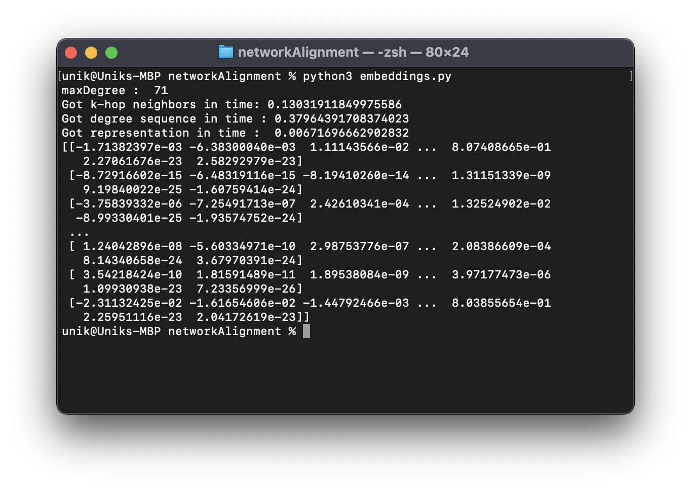
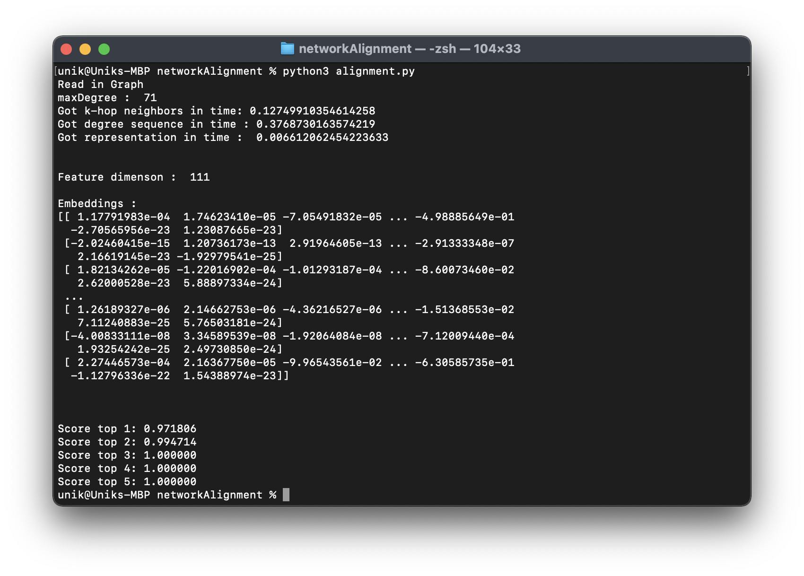
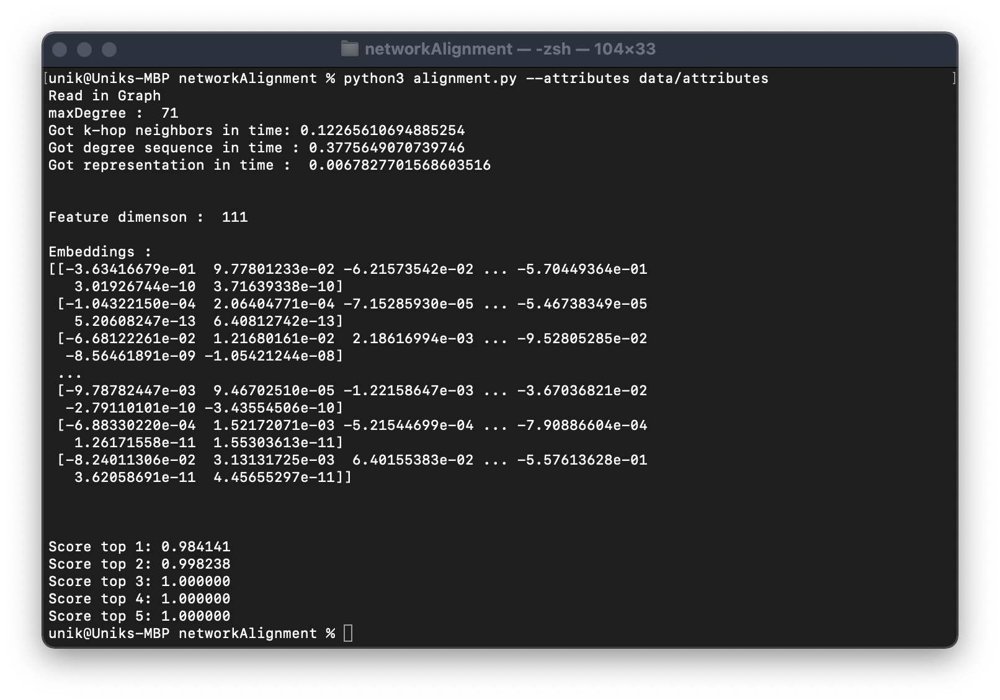

# Network Alignment

* Network alignment is a process of finding corresponding nodes between different graphs or networks. 
* A well-known application of network alignment is to map user accounts from different social networks that belong to the same person.
* In this project we first find the node embeddings og graphs and then align nodes using these embeddings

This is python implementation of following paper: https://gemslab.github.io/papers/heimann-2018-regal.pdf

# Installation
```bash
pip3 install -r requirements.txt
```

# Usage

To get embeddings only:
```bash
python3 embeddings.py
```

To align nodes(without attributes):
```bash
python3 alignment.py
```

To align nodes(with attributes):
```bash
python3 alignment.py --attributes data/attributes
```

See argParser() for more details about arguments.

# Instructions
* Combine two graphs with adjacency matrices A1, A2, into combined matrix: [A1 0; 0 A2]
* Save edge list of combined graph in combined_edges.txt file using NetworkX write_edgelist() method.
* Save a dictionary of true alignments (node in G1 : node in G2) in true_alignments.txt as pickled data.
* Pass no of nodes in G1 as command line argument with --g1_size flag. (If none we assume both graphs have same size)

# Screenshots

Embeddings only:


Alignment without attributes:


Alignment with attributes:
